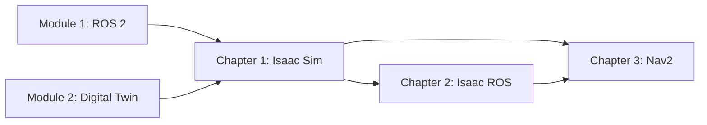

# Module 3: The AI-Robot Brain (NVIDIA Isaac™)

Welcome to Module 3, where you'll learn to leverage NVIDIA's Isaac platform to build the perception and navigation "brain" for your humanoid robot. This module covers the complete pipeline from photorealistic simulation to autonomous navigation.

## What You'll Learn

This module covers three essential capabilities for building intelligent humanoid robots:

1. **Isaac Sim** - Photorealistic simulation and synthetic data generation
2. **Isaac ROS** - GPU-accelerated perception pipelines including Visual SLAM
3. **Nav2** - Autonomous navigation with localization and path planning

## Prerequisites

Before starting this module, you should have completed:

- **Module 1**: ROS 2 Fundamentals - understanding of topics, services, and launch files
- **Module 2**: Digital Twin - experience with Gazebo and robot simulation

### Hardware Requirements

| Component | Minimum | Recommended |
|-----------|---------|-------------|
| GPU | NVIDIA RTX 2070 | NVIDIA RTX 3080+ |
| VRAM | 8 GB | 12+ GB |
| RAM | 32 GB | 64 GB |
| Storage | 50 GB SSD | 100 GB NVMe |

### Software Requirements

- Ubuntu 22.04 LTS
- ROS 2 Humble Hawksbill
- NVIDIA Driver 525+ with CUDA 12.0+

## Module Structure

### Chapter 1: NVIDIA Isaac Sim

**Duration**: 90-120 minutes

Set up Isaac Sim for photorealistic robot simulation:
- Omniverse platform and USD scene format
- Loading humanoid robots with realistic physics
- ROS 2 bridge configuration with Action Graphs
- Synthetic data generation with Omniverse Replicator

[Start Chapter 1 →](/docs/module-3-nvidia-isaac/chapter-1-isaac-sim)

### Chapter 2: Isaac ROS for Perception

**Duration**: 90-120 minutes

Build GPU-accelerated perception pipelines:
- Isaac ROS architecture and Nitros acceleration
- Visual SLAM with cuVSLAM for real-time localization
- DNN inference for object detection
- Sensor data flow and performance optimization

[Start Chapter 2 →](/docs/module-3-nvidia-isaac/chapter-2-isaac-ros)

### Chapter 3: Navigation with Nav2

**Duration**: 60-90 minutes

Implement autonomous navigation:
- Nav2 architecture and behavior trees
- Mapping with SLAM Toolbox
- Localization with AMCL
- Path planning for humanoid robots

[Start Chapter 3 →](/docs/module-3-nvidia-isaac/chapter-3-nav2)

## Learning Path



## Code Examples

All code examples for this module are available in the `examples/module-3/` directory:

```text
examples/module-3/
├── chapter-1/
│   ├── isaac_sim_scene/
│   ├── synthetic_data/
│   └── launch_sim.py
├── chapter-2/
│   ├── vslam/
│   ├── perception/
│   └── config/
└── chapter-3/
    ├── nav2_config/
    ├── mapping/
    └── scripts/
```

## Getting Help

If you encounter issues:

1. Check the hardware requirements match your system
2. Verify NVIDIA drivers and CUDA are properly installed
3. Review the troubleshooting sections in each chapter
4. Consult the official [NVIDIA Isaac documentation](https://developer.nvidia.com/isaac)

Let's begin building the AI brain for your humanoid robot!
