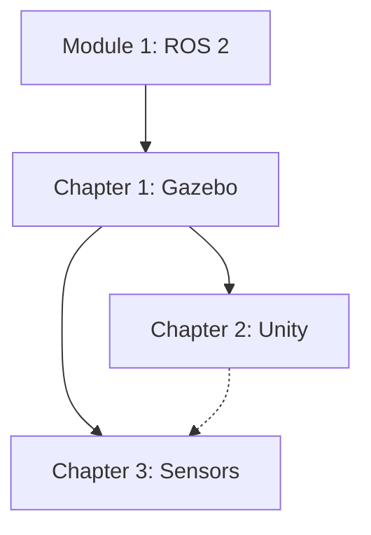

# Content Model: Module 2 – The Digital Twin (Gazebo & Unity)

**Feature**: 002-digital-twin-module
**Date**: 2025-12-17
**Purpose**: Define chapter structure, learning objectives, and content outlines

## Module Overview

**Title**: Module 2 – The Digital Twin (Gazebo & Unity)
**Target Audience**: AI and robotics engineers building simulated physical environments
**Prerequisites**: Module 1 (ROS 2 Fundamentals, rclpy, URDF)
**Estimated Duration**: 4-6 hours total

## Chapter Structure

### Chapter 1: Physics Simulation with Gazebo

**File**: `frontend_book/docs/module-2-digital-twin/chapter-1-gazebo.md`
**Duration**: 90-120 minutes
**Word Count Target**: 2500-3000 words

#### Learning Objectives

By the end of this chapter, readers will be able to:
1. Explain what a digital twin is and its role in robotics development
2. Understand physics engine fundamentals (rigid body dynamics, gravity, collisions)
3. Import URDF humanoid robots into Gazebo Harmonic
4. Configure Gazebo world files with environments and physics properties
5. Run physics simulations and observe robot behavior

#### Content Outline

1. **Introduction to Digital Twins** (300 words)
   - Definition and value proposition
   - Digital twin vs. simulation
   - Use cases in robotics development

2. **Physics Engine Fundamentals** (500 words)
   - Rigid body dynamics overview
   - Gravity and mass properties
   - Collision detection and response
   - Friction and contact dynamics
   - Gazebo's physics engines (DART, Bullet, ODE)

3. **Gazebo Harmonic Overview** (400 words)
   - Evolution from Gazebo Classic to Gazebo Sim
   - Key features and architecture
   - ROS 2 integration via ros_gz

4. **Setting Up Gazebo Environment** (400 words)
   - Installation verification
   - Launching Gazebo Sim
   - Understanding the GUI
   - Command-line tools

5. **Importing URDF Humanoids** (600 words)
   - URDF to SDF conversion
   - Spawning robots in Gazebo
   - Verifying robot structure
   - Common import issues and solutions

6. **Creating World Files** (500 words)
   - SDF world file structure
   - Adding ground planes and obstacles
   - Configuring physics properties
   - Lighting and visual elements

7. **Running Simulations** (300 words)
   - Starting and pausing simulation
   - Observing physics behavior
   - ROS 2 topic integration
   - Saving and loading simulation states

8. **Hands-On Exercise** (included in word count)
   - Import Module 1 humanoid URDF
   - Create custom world with obstacles
   - Configure collision properties
   - Verify physics behavior

#### Code Examples

| Example | Description | File Location |
|---------|-------------|---------------|
| humanoid_world.sdf | Complete Gazebo world file | examples/module-2/chapter-1/humanoid_gazebo/worlds/ |
| spawn_humanoid.launch.py | ROS 2 launch file for spawning | examples/module-2/chapter-1/humanoid_gazebo/launch/ |
| urdf_to_sdf.sh | URDF conversion script | examples/module-2/chapter-1/humanoid_gazebo/ |

---

### Chapter 2: Digital Twins & HRI in Unity

**File**: `frontend_book/docs/module-2-digital-twin/chapter-2-unity.md`
**Duration**: 90-120 minutes
**Word Count Target**: 2500-3000 words

#### Learning Objectives

By the end of this chapter, readers will be able to:
1. Explain when to use Unity vs. Gazebo for simulation
2. Set up Unity with ROS 2 integration using Unity Robotics Hub
3. Import and render robot models with high-fidelity graphics
4. Implement bidirectional ROS-Unity communication
5. Create basic human-robot interaction scenarios

#### Content Outline

1. **Unity for Robotics** (300 words)
   - High-fidelity rendering advantages
   - Unity vs. Gazebo comparison
   - When to use each platform
   - Unity Robotics Hub overview

2. **Setting Up Unity Environment** (500 words)
   - Unity Hub installation
   - Creating a robotics project
   - Installing Unity Robotics packages
   - Project configuration

3. **ROS-Unity Integration** (600 words)
   - ROS-TCP-Connector setup
   - ROS-TCP-Endpoint configuration
   - Message type support
   - Connection architecture

4. **Importing Robot Models** (500 words)
   - URDF Importer usage
   - Material and texture setup
   - Joint configuration
   - Physics components (ArticulationBody)

5. **Creating Realistic Environments** (400 words)
   - Scene setup and lighting
   - Materials and shaders
   - Adding environment objects
   - Performance optimization

6. **Bidirectional Communication** (400 words)
   - Publishing from Unity to ROS 2
   - Subscribing to ROS 2 topics
   - Service calls
   - State synchronization patterns

7. **Human-Robot Interaction Basics** (300 words)
   - Adding human avatars
   - Proximity detection
   - Interactive scenarios
   - Safety zone visualization

8. **Hands-On Exercise** (included in word count)
   - Set up Unity-ROS 2 connection
   - Import humanoid robot
   - Create interactive environment
   - Implement simple HRI scenario

#### Code Examples

| Example | Description | File Location |
|---------|-------------|---------------|
| ROSConnection.cs | Unity ROS connection setup | examples/module-2/chapter-2/unity_project/Scripts/ |
| RobotController.cs | Robot state subscriber | examples/module-2/chapter-2/unity_project/Scripts/ |
| HRIManager.cs | Human-robot interaction logic | examples/module-2/chapter-2/unity_project/Scripts/ |
| ros_tcp_endpoint.launch.py | ROS 2 endpoint launch | examples/module-2/chapter-2/ros_unity_bridge/ |

---

### Chapter 3: Sensor Simulation & Validation

**File**: `frontend_book/docs/module-2-digital-twin/chapter-3-sensors.md`
**Duration**: 60-90 minutes
**Word Count Target**: 2000-2500 words

#### Learning Objectives

By the end of this chapter, readers will be able to:
1. Configure LiDAR sensors in Gazebo with realistic parameters
2. Set up depth cameras with RGB-D output
3. Simulate IMU sensors with proper noise models
4. Apply Gaussian noise, bias, and drift to sensor data
5. Feed simulated sensor data to ROS 2 perception nodes

#### Content Outline

1. **Sensor Simulation Fundamentals** (300 words)
   - Why simulate sensors?
   - Sim-to-real gap
   - Noise modeling importance
   - Gazebo sensor plugins

2. **LiDAR Simulation** (500 words)
   - LiDAR principles and parameters
   - Gazebo LiDAR plugin configuration
   - Point cloud generation
   - Range limits and resolution
   - ROS 2 topic publishing

3. **Depth Camera Simulation** (500 words)
   - RGB-D camera basics
   - Gazebo depth camera plugin
   - Field of view and resolution
   - Depth range configuration
   - Image and point cloud output

4. **IMU Simulation** (400 words)
   - IMU components (accelerometer, gyroscope)
   - Gazebo IMU plugin setup
   - Update rates
   - Orientation data

5. **Sensor Noise Models** (400 words)
   - Gaussian noise
   - Bias and drift
   - Configuring noise in SDF
   - Validating noise behavior

6. **ROS 2 Sensor Integration** (300 words)
   - ros_gz_bridge for sensors
   - Topic mapping
   - Message types
   - Visualizing sensor data in RViz2

7. **Hands-On Exercise** (included in word count)
   - Add all three sensors to humanoid
   - Configure realistic noise models
   - Verify data in ROS 2
   - Process sensor data with simple node

#### Code Examples

| Example | Description | File Location |
|---------|-------------|---------------|
| lidar_config.sdf | LiDAR sensor configuration | examples/module-2/chapter-3/sensor_configs/ |
| depth_camera_config.sdf | Depth camera configuration | examples/module-2/chapter-3/sensor_configs/ |
| imu_config.sdf | IMU sensor configuration | examples/module-2/chapter-3/sensor_configs/ |
| sensor_subscriber.py | ROS 2 sensor data processor | examples/module-2/chapter-3/sensor_processing/ |
| sensor_bridge.launch.py | Bridge launch file | examples/module-2/chapter-3/sensor_processing/ |

---

## Cross-Cutting Content Elements

### Consistent Chapter Structure

Each chapter follows this template:
1. Learning Objectives (bulleted list)
2. Prerequisites reminder
3. Main content sections with code blocks
4. Hands-on exercises with step-by-step instructions
5. Key Takeaways summary
6. Next Steps / What's Next

### Visual Assets Required

| Asset | Chapter | Description |
|-------|---------|-------------|
| digital-twin-concept.png | 1 | Digital twin architecture diagram |
| gazebo-gui-overview.png | 1 | Gazebo interface with labels |
| urdf-to-sdf-flow.png | 1 | Conversion workflow diagram |
| unity-ros-architecture.png | 2 | Unity-ROS communication diagram |
| unity-scene-hierarchy.png | 2 | Unity project structure |
| sensor-placement.png | 3 | Humanoid with sensor positions |
| noise-comparison.png | 3 | Clean vs. noisy sensor data |

### Docusaurus Features to Use

- Tabs for OS-specific instructions (Ubuntu/Windows)
- Admonitions for tips, warnings, notes
- Code blocks with syntax highlighting and titles
- Collapsible sections for detailed explanations
- Internal links between chapters

## Content Dependencies

- Chapter 1 requires Module 1 URDF knowledge
- Chapter 2 builds on Gazebo concepts from Chapter 1
- Chapter 3 uses Gazebo setup from Chapter 1
- Chapter 3 can reference Unity for visualization but is optional

## Quality Checklist

- [ ] All code examples tested and runnable
- [ ] Learning objectives are measurable
- [ ] Exercises have clear success criteria
- [ ] Technical accuracy verified against official docs
- [ ] Consistent terminology across chapters
- [ ] Appropriate depth for target audience
