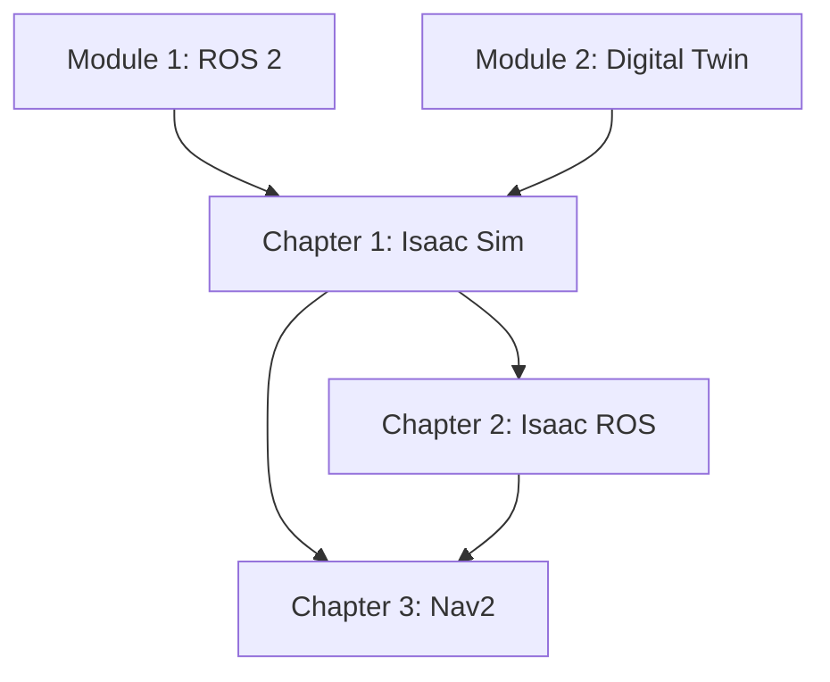

# Content Model: Module 3 – The AI-Robot Brain (NVIDIA Isaac™)

**Feature**: 003-nvidia-isaac-module
**Date**: 2025-12-21
**Purpose**: Define chapter structure, learning objectives, and content outlines

## Module Overview

**Title**: Module 3 – The AI-Robot Brain (NVIDIA Isaac™)
**Target Audience**: AI and robotics engineers building perception and navigation systems
**Prerequisites**: Module 1 (ROS 2), Module 2 (Digital Twin/Gazebo)
**Estimated Duration**: 5-7 hours total

## Chapter Structure

### Chapter 1: NVIDIA Isaac Sim

**File**: `frontend_book/docs/module-3-nvidia-isaac/chapter-1-isaac-sim.md`
**Duration**: 90-120 minutes
**Word Count Target**: 2500-3000 words

#### Learning Objectives

By the end of this chapter, readers will be able to:
1. Explain the role of Isaac Sim in the NVIDIA robotics ecosystem
2. Install and configure Isaac Sim with ROS 2 Humble
3. Load humanoid robot models (URDF/USD) with realistic physics
4. Configure sensors and ROS 2 bridge using action graphs
5. Generate synthetic training data with Omniverse Replicator

#### Content Outline

1. **Introduction to Isaac Sim** (300 words)
   - NVIDIA Omniverse platform overview
   - Isaac Sim capabilities vs. Gazebo
   - Photorealistic rendering for perception

2. **Installation and Setup** (400 words)
   - System requirements (GPU, RAM, storage)
   - Omniverse Launcher installation
   - Isaac Sim installation and first launch
   - Nucleus server configuration

3. **USD Scene Fundamentals** (400 words)
   - Universal Scene Description (USD) format
   - Stage hierarchy and prims
   - Loading and organizing assets
   - Physics scene configuration

4. **Loading Humanoid Robots** (500 words)
   - URDF to USD conversion
   - Direct USD robot loading
   - Joint and articulation configuration
   - Material assignment and rendering

5. **ROS 2 Bridge Configuration** (500 words)
   - Action Graph fundamentals
   - ROS2 Bridge extension
   - Publishing sensor data (camera, LiDAR, IMU)
   - Subscribing to joint commands

6. **Synthetic Data Generation** (400 words)
   - Omniverse Replicator overview
   - Domain randomization
   - Ground truth annotations
   - Data export formats

7. **Hands-On Exercise** (included in word count)
   - Create Isaac Sim scene with humanoid
   - Configure sensors and ROS 2 bridge
   - Verify data flow to ROS 2 topics

#### Code Examples

| Example | Description | File Location |
|---------|-------------|---------------|
| humanoid_scene.usd | Complete Isaac Sim scene | examples/module-3/chapter-1/isaac_sim_scene/ |
| action_graph.json | ROS 2 bridge configuration | examples/module-3/chapter-1/isaac_sim_scene/ |
| replicator_config.py | Synthetic data script | examples/module-3/chapter-1/synthetic_data/ |
| launch_sim.py | Python launch script | examples/module-3/chapter-1/ |

---

### Chapter 2: Isaac ROS for Perception

**File**: `frontend_book/docs/module-3-nvidia-isaac/chapter-2-isaac-ros.md`
**Duration**: 90-120 minutes
**Word Count Target**: 2500-3000 words

#### Learning Objectives

By the end of this chapter, readers will be able to:
1. Explain Isaac ROS architecture and GPU acceleration benefits
2. Install Isaac ROS packages on Ubuntu or Jetson
3. Configure and run Isaac ROS Visual SLAM (cuVSLAM)
4. Build visual perception pipelines with DNN inference
5. Integrate perception outputs with downstream systems

#### Content Outline

1. **Isaac ROS Overview** (300 words)
   - NVIDIA acceleration for ROS 2
   - Nitros zero-copy message passing
   - Available perception packages
   - Platform support (x86, Jetson)

2. **Installation and Setup** (400 words)
   - Docker-based installation
   - Native installation on Jetson
   - Isaac ROS common dependencies
   - Workspace configuration

3. **Visual SLAM with cuVSLAM** (600 words)
   - Visual odometry fundamentals
   - cuVSLAM architecture and features
   - Stereo camera configuration
   - Launch and parameter tuning
   - Pose output and visualization

4. **Visual Perception Pipelines** (500 words)
   - Image pipeline (rectification, resize)
   - DNN inference nodes (DetectNet, SegmentNet)
   - AprilTag detection
   - Obstacle detection

5. **Sensor Data Flow** (400 words)
   - Camera input sources (Isaac Sim, real cameras)
   - GPU memory management
   - Topic naming conventions
   - TF tree integration

6. **Performance Optimization** (300 words)
   - Profiling with nvprof/nsight
   - Node graph optimization
   - Memory pool configuration
   - Frame rate management

7. **Hands-On Exercise** (included in word count)
   - Launch Isaac ROS VSLAM with simulated input
   - Verify pose estimation in RViz2
   - Measure GPU utilization and FPS

#### Code Examples

| Example | Description | File Location |
|---------|-------------|---------------|
| isaac_ros_vslam.launch.py | VSLAM launch configuration | examples/module-3/chapter-2/vslam/ |
| perception_pipeline.launch.py | Multi-node perception | examples/module-3/chapter-2/perception/ |
| camera_config.yaml | Camera parameters | examples/module-3/chapter-2/config/ |
| dnn_inference.launch.py | Object detection launch | examples/module-3/chapter-2/perception/ |

---

### Chapter 3: Navigation with Nav2

**File**: `frontend_book/docs/module-3-nvidia-isaac/chapter-3-nav2.md`
**Duration**: 60-90 minutes
**Word Count Target**: 2000-2500 words

#### Learning Objectives

By the end of this chapter, readers will be able to:
1. Explain Nav2 architecture and components
2. Configure Nav2 for humanoid robot navigation
3. Create maps using SLAM Toolbox
4. Set up localization with AMCL
5. Execute autonomous navigation to goal poses

#### Content Outline

1. **Nav2 Architecture** (300 words)
   - Navigation stack overview
   - Behavior trees and servers
   - Planners and controllers
   - Recovery behaviors

2. **Costmap Configuration** (400 words)
   - Global and local costmaps
   - Layer configuration (static, obstacle, inflation)
   - Humanoid-specific considerations
   - Sensor sources

3. **Mapping with SLAM Toolbox** (400 words)
   - SLAM Toolbox vs. other SLAM methods
   - Configuration for indoor environments
   - Map saving and loading
   - Map editing and cleanup

4. **Localization with AMCL** (400 words)
   - Particle filter localization
   - Parameter configuration
   - Initial pose estimation
   - Localization quality monitoring

5. **Path Planning** (300 words)
   - Global planners (NavFn, Smac)
   - Local planners (DWB, MPPI)
   - Planner selection for humanoids
   - Goal tolerance configuration

6. **Complete Navigation Workflow** (200 words)
   - Launching the full stack
   - Goal sending via RViz2
   - Programmatic goal sending
   - Navigation feedback

7. **Hands-On Exercise** (included in word count)
   - Create a map using SLAM Toolbox
   - Configure Nav2 for humanoid
   - Execute navigation to multiple goals

#### Code Examples

| Example | Description | File Location |
|---------|-------------|---------------|
| nav2_params.yaml | Complete Nav2 configuration | examples/module-3/chapter-3/nav2_config/ |
| humanoid_nav.launch.py | Navigation launch file | examples/module-3/chapter-3/nav2_config/ |
| slam_toolbox.launch.py | Mapping launch file | examples/module-3/chapter-3/mapping/ |
| navigation_goal.py | Programmatic goal sender | examples/module-3/chapter-3/scripts/ |

---

## Cross-Cutting Content Elements

### Consistent Chapter Structure

Each chapter follows this template:
1. Learning Objectives (bulleted list)
2. Prerequisites reminder
3. Main content sections with code blocks
4. Hands-on exercises with step-by-step instructions
5. Key Takeaways summary
6. Next Steps / What's Next

### Visual Assets Required

| Asset | Chapter | Description |
|-------|---------|-------------|
| isaac-sim-overview.png | 1 | Isaac Sim GUI with humanoid |
| usd-hierarchy.png | 1 | USD scene structure diagram |
| action-graph-ros.png | 1 | ROS 2 bridge action graph |
| isaac-ros-pipeline.png | 2 | Perception pipeline diagram |
| vslam-output.png | 2 | VSLAM visualization in RViz2 |
| nav2-architecture.png | 3 | Nav2 component diagram |
| costmap-layers.png | 3 | Costmap layer visualization |

### Docusaurus Features to Use

- Tabs for platform-specific instructions (x86/Jetson)
- Admonitions for tips, warnings, hardware requirements
- Code blocks with syntax highlighting and titles
- Collapsible sections for detailed explanations
- Internal links between chapters

## Content Dependencies

- Chapter 1 requires Module 1-2 knowledge
- Chapter 2 builds on Isaac Sim from Chapter 1
- Chapter 3 uses perception from Chapter 2

## Quality Checklist

- [ ] All code examples tested and runnable
- [ ] Learning objectives are measurable
- [ ] Exercises have clear success criteria
- [ ] Technical accuracy verified against NVIDIA docs
- [ ] Consistent terminology across chapters
- [ ] Hardware requirements clearly stated
