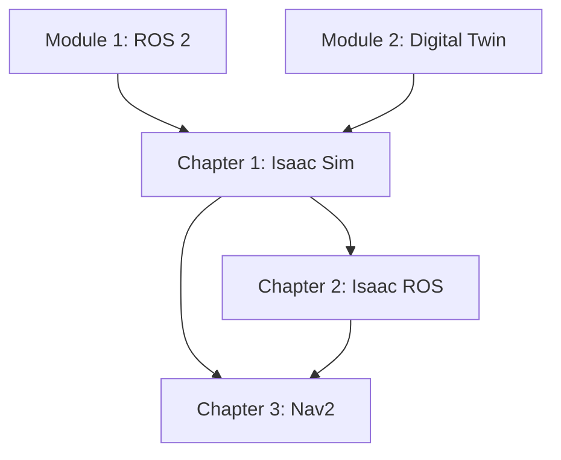

# Tasks: Module 3 – The AI-Robot Brain (NVIDIA Isaac™)

**Input**: Design documents from `/specs/003-nvidia-isaac-module/`
**Prerequisites**: plan.md ✓, spec.md ✓, research.md ✓, content-model.md ✓

**Tests**: Not requested in specification - focusing on documentation tasks.

**Organization**: Tasks are grouped by user story to enable independent implementation and testing of each chapter.

## Format: `[ID] [P?] [Story] Description`

- **[P]**: Can run in parallel (different files, no dependencies)
- **[Story]**: Which user story this task belongs to (US1=Isaac Sim, US2=Isaac ROS, US3=Nav2)
- Include exact file paths in descriptions

## Path Conventions

- **Documentation**: `frontend_book/docs/module-3-nvidia-isaac/`
- **Code Examples**: `examples/module-3/chapter-N/`

---

## Phase 1: Setup (Module Structure)

**Purpose**: Create Docusaurus module structure and category configuration

- [ ] T001 Create module directory at frontend_book/docs/module-3-nvidia-isaac/
- [ ] T002 Create _category_.json with module metadata in frontend_book/docs/module-3-nvidia-isaac/
- [ ] T003 [P] Create index.md module overview in frontend_book/docs/module-3-nvidia-isaac/
- [ ] T004 [P] Create examples directory structure at examples/module-3/

---

## Phase 2: Foundational (Example Code Framework)

**Purpose**: Create code example structure that all chapters depend on

**⚠️ CRITICAL**: Chapter content references these examples

- [ ] T005 Create chapter-1 example directories at examples/module-3/chapter-1/isaac_sim_scene/
- [ ] T006 [P] Create chapter-1 synthetic_data directory at examples/module-3/chapter-1/synthetic_data/
- [ ] T007 [P] Create chapter-2 example directories at examples/module-3/chapter-2/vslam/
- [ ] T008 [P] Create chapter-2 perception directory at examples/module-3/chapter-2/perception/
- [ ] T009 [P] Create chapter-2 config directory at examples/module-3/chapter-2/config/
- [ ] T010 [P] Create chapter-3 example directories at examples/module-3/chapter-3/nav2_config/
- [ ] T011 [P] Create chapter-3 mapping directory at examples/module-3/chapter-3/mapping/
- [ ] T012 [P] Create chapter-3 scripts directory at examples/module-3/chapter-3/scripts/

**Checkpoint**: Example directory structure ready - chapter implementation can begin

---

## Phase 3: User Story 1 - Isaac Sim Photorealistic Simulation (Priority: P1) 🎯 MVP

**Goal**: Set up NVIDIA Isaac Sim for photorealistic simulation with synthetic data generation and ROS 2 integration.

**Independent Test**: Load humanoid robot model in Isaac Sim, render photorealistic scenes, export synthetic camera/LiDAR data to ROS 2 topics.

**Word Count Target**: 2500-3000 words | **Duration**: 90-120 minutes

### Implementation for User Story 1

- [ ] T013 [US1] Write Introduction to Isaac Sim section (300 words) covering Omniverse platform, capabilities vs Gazebo, photorealistic rendering in frontend_book/docs/module-3-nvidia-isaac/chapter-1-isaac-sim.md
- [ ] T014 [US1] Write Installation and Setup section (400 words) covering system requirements, Omniverse Launcher, Isaac Sim installation, Nucleus server in frontend_book/docs/module-3-nvidia-isaac/chapter-1-isaac-sim.md
- [ ] T015 [US1] Write USD Scene Fundamentals section (400 words) covering USD format, stage hierarchy, prims, asset loading, physics configuration in frontend_book/docs/module-3-nvidia-isaac/chapter-1-isaac-sim.md
- [ ] T016 [US1] Write Loading Humanoid Robots section (500 words) covering URDF to USD conversion, joint/articulation config, materials in frontend_book/docs/module-3-nvidia-isaac/chapter-1-isaac-sim.md
- [ ] T017 [US1] Write ROS 2 Bridge Configuration section (500 words) covering Action Graphs, ROS2 Bridge extension, sensor publishing, joint commands in frontend_book/docs/module-3-nvidia-isaac/chapter-1-isaac-sim.md
- [ ] T018 [US1] Write Synthetic Data Generation section (400 words) covering Omniverse Replicator, domain randomization, ground truth, export formats in frontend_book/docs/module-3-nvidia-isaac/chapter-1-isaac-sim.md
- [ ] T019 [US1] Write Hands-On Exercise with step-by-step instructions for creating Isaac Sim scene with humanoid and ROS 2 bridge in frontend_book/docs/module-3-nvidia-isaac/chapter-1-isaac-sim.md
- [ ] T020 [P] [US1] Create humanoid_scene.usd example (or placeholder with comments) at examples/module-3/chapter-1/isaac_sim_scene/humanoid_scene.usd
- [ ] T021 [P] [US1] Create action_graph.json ROS 2 bridge configuration at examples/module-3/chapter-1/isaac_sim_scene/action_graph.json
- [ ] T022 [P] [US1] Create replicator_config.py synthetic data script at examples/module-3/chapter-1/synthetic_data/replicator_config.py
- [ ] T023 [P] [US1] Create launch_sim.py Python launch script at examples/module-3/chapter-1/launch_sim.py
- [ ] T024 [US1] Add Learning Objectives, Prerequisites, Key Takeaways, and Next Steps sections to chapter-1-isaac-sim.md

**Checkpoint**: Chapter 1 complete - Isaac Sim documentation fully functional and testable

---

## Phase 4: User Story 2 - Isaac ROS Perception Pipelines (Priority: P2)

**Goal**: Implement hardware-accelerated visual perception using Isaac ROS for real-time VSLAM and object detection.

**Independent Test**: Run Isaac ROS VSLAM with simulated stereo camera input, verify pose estimation accuracy and GPU utilization.

**Word Count Target**: 2500-3000 words | **Duration**: 90-120 minutes

### Implementation for User Story 2

- [ ] T025 [US2] Write Isaac ROS Overview section (300 words) covering NVIDIA acceleration, Nitros zero-copy, available packages, platform support in frontend_book/docs/module-3-nvidia-isaac/chapter-2-isaac-ros.md
- [ ] T026 [US2] Write Installation and Setup section (400 words) covering Docker installation, Jetson native, common dependencies, workspace config in frontend_book/docs/module-3-nvidia-isaac/chapter-2-isaac-ros.md
- [ ] T027 [US2] Write Visual SLAM with cuVSLAM section (600 words) covering visual odometry, cuVSLAM architecture, stereo config, launch, tuning, pose output in frontend_book/docs/module-3-nvidia-isaac/chapter-2-isaac-ros.md
- [ ] T028 [US2] Write Visual Perception Pipelines section (500 words) covering image pipeline, DNN inference, AprilTag, obstacle detection in frontend_book/docs/module-3-nvidia-isaac/chapter-2-isaac-ros.md
- [ ] T029 [US2] Write Sensor Data Flow section (400 words) covering camera sources, GPU memory, topic naming, TF tree in frontend_book/docs/module-3-nvidia-isaac/chapter-2-isaac-ros.md
- [ ] T030 [US2] Write Performance Optimization section (300 words) covering profiling, node optimization, memory pools, frame rate in frontend_book/docs/module-3-nvidia-isaac/chapter-2-isaac-ros.md
- [ ] T031 [US2] Write Hands-On Exercise with step-by-step instructions for VSLAM launch and verification in frontend_book/docs/module-3-nvidia-isaac/chapter-2-isaac-ros.md
- [ ] T032 [P] [US2] Create isaac_ros_vslam.launch.py at examples/module-3/chapter-2/vslam/isaac_ros_vslam.launch.py
- [ ] T033 [P] [US2] Create perception_pipeline.launch.py at examples/module-3/chapter-2/perception/perception_pipeline.launch.py
- [ ] T034 [P] [US2] Create camera_config.yaml at examples/module-3/chapter-2/config/camera_config.yaml
- [ ] T035 [P] [US2] Create dnn_inference.launch.py at examples/module-3/chapter-2/perception/dnn_inference.launch.py
- [ ] T036 [US2] Add Learning Objectives, Prerequisites, Key Takeaways, and Next Steps sections to chapter-2-isaac-ros.md

**Checkpoint**: Chapter 2 complete - Isaac ROS perception documentation fully functional

---

## Phase 5: User Story 3 - Navigation with Nav2 (Priority: P3)

**Goal**: Integrate Nav2 for autonomous navigation with localization, path planning, and goal-seeking for humanoid robots.

**Independent Test**: Command robot to navigate to goal pose in simulation, measure path planning success rate and navigation completion.

**Word Count Target**: 2000-2500 words | **Duration**: 60-90 minutes

### Implementation for User Story 3

- [ ] T037 [US3] Write Nav2 Architecture section (300 words) covering navigation stack, behavior trees, planners, controllers, recovery in frontend_book/docs/module-3-nvidia-isaac/chapter-3-nav2.md
- [ ] T038 [US3] Write Costmap Configuration section (400 words) covering global/local costmaps, layers, humanoid considerations, sensors in frontend_book/docs/module-3-nvidia-isaac/chapter-3-nav2.md
- [ ] T039 [US3] Write Mapping with SLAM Toolbox section (400 words) covering SLAM Toolbox config, indoor environments, map save/load, editing in frontend_book/docs/module-3-nvidia-isaac/chapter-3-nav2.md
- [ ] T040 [US3] Write Localization with AMCL section (400 words) covering particle filter, parameters, initial pose, quality monitoring in frontend_book/docs/module-3-nvidia-isaac/chapter-3-nav2.md
- [ ] T041 [US3] Write Path Planning section (300 words) covering global planners, local planners, humanoid selection, goal tolerance in frontend_book/docs/module-3-nvidia-isaac/chapter-3-nav2.md
- [ ] T042 [US3] Write Complete Navigation Workflow section (200 words) covering full stack launch, goal via RViz2, programmatic goals, feedback in frontend_book/docs/module-3-nvidia-isaac/chapter-3-nav2.md
- [ ] T043 [US3] Write Hands-On Exercise with step-by-step instructions for mapping and navigation in frontend_book/docs/module-3-nvidia-isaac/chapter-3-nav2.md
- [ ] T044 [P] [US3] Create nav2_params.yaml at examples/module-3/chapter-3/nav2_config/nav2_params.yaml
- [ ] T045 [P] [US3] Create humanoid_nav.launch.py at examples/module-3/chapter-3/nav2_config/humanoid_nav.launch.py
- [ ] T046 [P] [US3] Create slam_toolbox.launch.py at examples/module-3/chapter-3/mapping/slam_toolbox.launch.py
- [ ] T047 [P] [US3] Create navigation_goal.py programmatic goal sender at examples/module-3/chapter-3/scripts/navigation_goal.py
- [ ] T048 [US3] Add Learning Objectives, Prerequisites, Key Takeaways, and Next Steps sections to chapter-3-nav2.md

**Checkpoint**: Chapter 3 complete - Nav2 navigation documentation fully functional

---

## Phase 6: Polish & Cross-Cutting Concerns

**Purpose**: Final validation and cross-chapter consistency

- [ ] T049 [P] Verify all internal links between chapters work correctly
- [ ] T050 [P] Verify all code examples are syntactically correct (Python, YAML, JSON)
- [ ] T051 [P] Add platform-specific tabs (x86/Jetson) where appropriate using Docusaurus Tabs
- [ ] T052 [P] Add admonitions for tips, warnings, and hardware requirements
- [ ] T053 Verify consistent terminology with NVIDIA and ROS 2 official documentation
- [ ] T054 Run Docusaurus build to verify no errors (npm run build)
- [ ] T055 Update module index.md with complete chapter links and overview

---

## Dependencies & Execution Order

### Phase Dependencies

- **Setup (Phase 1)**: No dependencies - can start immediately
- **Foundational (Phase 2)**: Depends on Setup completion - creates example structure
- **User Stories (Phase 3-5)**: All depend on Foundational phase completion
  - User stories can proceed in parallel (if staffed)
  - Or sequentially in priority order (P1 → P2 → P3)
- **Polish (Phase 6)**: Depends on all user stories being complete

### User Story Dependencies

- **User Story 1 (P1)**: Can start after Foundational (Phase 2) - No dependencies on other stories
- **User Story 2 (P2)**: Can start after Foundational (Phase 2) - References Isaac Sim from US1 but independently testable
- **User Story 3 (P3)**: Can start after Foundational (Phase 2) - Uses perception from US2 but independently testable

### Content Dependencies (from spec.md)



### Parallel Opportunities

- All Setup tasks marked [P] can run in parallel
- All Foundational tasks (T005-T012) marked [P] can run in parallel
- Code example tasks within each story (marked [P]) can run in parallel
- Different user stories can be worked on in parallel by different team members
- Polish tasks marked [P] can run in parallel

---

## Parallel Example: User Story 1

```bash
# Launch all code examples for User Story 1 together:
Task: "Create humanoid_scene.usd example at examples/module-3/chapter-1/isaac_sim_scene/"
Task: "Create action_graph.json at examples/module-3/chapter-1/isaac_sim_scene/"
Task: "Create replicator_config.py at examples/module-3/chapter-1/synthetic_data/"
Task: "Create launch_sim.py at examples/module-3/chapter-1/"
```

---

## Implementation Strategy

### MVP First (User Story 1 Only)

1. Complete Phase 1: Setup (T001-T004)
2. Complete Phase 2: Foundational (T005-T012)
3. Complete Phase 3: User Story 1 - Isaac Sim (T013-T024)
4. **STOP and VALIDATE**: Build passes, Chapter 1 readable
5. Deploy/demo if ready

### Incremental Delivery

1. Setup + Foundational → Module structure ready
2. Add Chapter 1 (Isaac Sim) → Build → **MVP complete!**
3. Add Chapter 2 (Isaac ROS) → Build → Perception content ready
4. Add Chapter 3 (Nav2) → Build → Navigation content ready
5. Polish → Final validation → Module 3 complete

### Parallel Team Strategy

With multiple developers:

1. Team completes Setup + Foundational together
2. Once Foundational is done:
   - Developer A: User Story 1 (Isaac Sim)
   - Developer B: User Story 2 (Isaac ROS)
   - Developer C: User Story 3 (Nav2)
3. Chapters complete and integrate independently

---

## Task Summary

| Phase | Tasks | Parallel Tasks | Description |
|-------|-------|----------------|-------------|
| Phase 1: Setup | 4 | 2 | Module directory structure |
| Phase 2: Foundational | 8 | 7 | Example code directories |
| Phase 3: US1 Isaac Sim | 12 | 4 | Chapter 1 content + examples |
| Phase 4: US2 Isaac ROS | 12 | 4 | Chapter 2 content + examples |
| Phase 5: US3 Nav2 | 12 | 4 | Chapter 3 content + examples |
| Phase 6: Polish | 7 | 5 | Validation and consistency |
| **Total** | **55** | **26** | |

---

## Notes

- [P] tasks = different files, no dependencies
- [Story] label maps task to specific user story for traceability
- Each chapter should be independently completable and testable
- Commit after each task or logical group
- Stop at any checkpoint to validate chapter independently
- Word counts and durations from content-model.md
- All code examples must be syntactically correct per FR-017
