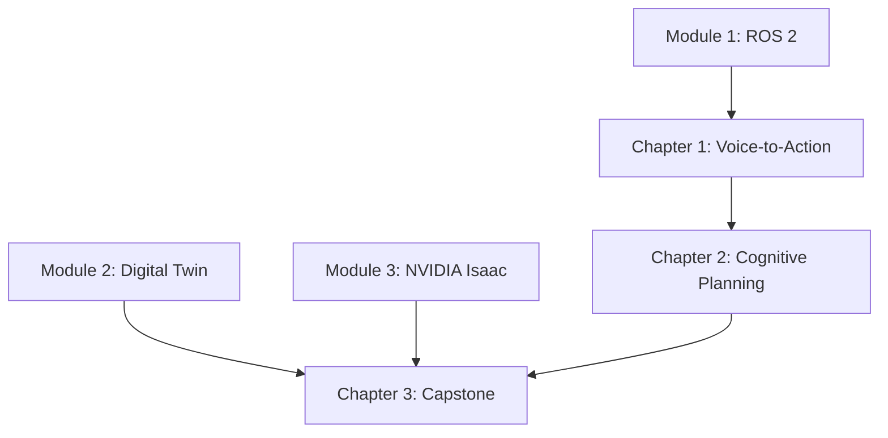

# Implementation Plan: Module 4 – Vision-Language-Action (VLA)

**Branch**: `004-vla-module` | **Date**: 2025-12-22 | **Spec**: [spec.md](./spec.md)
**Input**: Feature specification from `/specs/004-vla-module/spec.md`

## Summary

Create educational content teaching AI and robotics engineers to integrate language models with robotic perception and action. The module covers voice-controlled robot interfaces using OpenAI Whisper, LLM-based task planning with GPT-4, and a capstone project integrating all previous modules into an autonomous humanoid system.

## Technical Context

**Language/Version**: Python 3.10+ (ROS 2 Humble), Markdown (Docusaurus 3.x)
**Primary Dependencies**: OpenAI Whisper, openai Python package, audio_common, BehaviorTree.CPP, YASMIN
**Storage**: N/A (documentation project)
**Testing**: Docusaurus build validation, Python syntax checking
**Target Platform**: ROS 2 Humble on Ubuntu 22.04, NVIDIA RTX GPU
**Project Type**: Documentation with code examples
**Performance Goals**: Voice transcription >90% accuracy, LLM response <5s, chapter completion 90-120 minutes
**Constraints**: Docusaurus-compatible, syntactically correct examples, consistent with Modules 1-3
**Scale/Scope**: 3 chapters (~8000 words total), 15-20 code examples

## Constitution Check

*GATE: Documentation project - constitution principles applied to content quality*

| Principle | Status | Notes |
|-----------|--------|-------|
| Testable content | ✅ PASS | All code examples executable |
| Self-contained | ✅ PASS | Each chapter independently completable |
| Clear purpose | ✅ PASS | Well-defined learning objectives |
| Observability | ✅ PASS | Includes debugging/monitoring guidance |
| Simplicity | ✅ PASS | Start with minimal examples, build complexity |

## Project Structure

### Documentation (this feature)

```text
specs/004-vla-module/
├── spec.md              # Feature specification
├── plan.md              # This file
├── research.md          # Technology decisions
├── content-model.md     # Chapter outlines
├── checklists/
│   └── requirements.md  # Validation checklist
└── tasks.md             # Implementation tasks (created by /sp.tasks)
```

### Content Structure (Docusaurus)

```text
frontend_book/docs/module-4-vla/
├── _category_.json          # Module metadata
├── index.md                 # Module overview
├── chapter-1-voice-to-action.md
├── chapter-2-cognitive-planning.md
└── chapter-3-capstone.md
```

### Code Examples

```text
examples/module-4/
├── chapter-1/
│   ├── whisper_node/
│   │   ├── whisper_node.py      # Whisper ROS 2 node
│   │   └── package.xml
│   ├── audio_capture/
│   │   └── audio_config.yaml
│   ├── command_parser/
│   │   ├── intent_parser.py     # Intent extraction
│   │   └── commands.yaml        # Command definitions
│   └── voice_control.launch.py
├── chapter-2/
│   ├── llm_planner/
│   │   ├── planner_node.py      # LLM planning node
│   │   ├── capabilities.yaml    # Robot capability registry
│   │   └── prompts/
│   │       └── task_planner.txt # Prompt template
│   ├── action_executor/
│   │   ├── executor_node.py     # Action sequence executor
│   │   └── behavior_tree.xml
│   └── planning.launch.py
└── chapter-3/
    ├── autonomous_humanoid/
    │   ├── state_machine.py     # YASMIN state machine
    │   ├── humanoid_config.yaml # System configuration
    │   └── launch/
    │       └── full_system.launch.py
    ├── monitoring/
    │   └── dashboard_config.yaml
    └── demo_scenarios/
        ├── fetch_object.yaml
        └── navigate_and_report.yaml
```

**Structure Decision**: Documentation-focused structure with Docusaurus chapters and organized code examples per chapter. Follows established pattern from Modules 1-3.

## Architecture Decisions

### AD-001: Layered Voice Processing Pipeline

**Decision**: Separate nodes for audio capture, wake-word detection, and transcription

**Rationale**:
- Modularity enables independent testing and replacement
- Follows ROS 2 best practices for sensor processing
- Allows swapping Whisper for alternatives without code changes

**Trade-offs**:
- Slightly higher latency than monolithic solution
- More complex system setup
- Better maintainability and debugging

### AD-002: Hybrid Command Parsing

**Decision**: Rule-based parsing for common commands, LLM fallback for complex

**Rationale**:
- Fast response (<100ms) for simple commands (stop, move)
- LLM handles novel phrasings and complex tasks
- Reduces API costs and network dependency
- Graceful degradation if LLM unavailable

**Trade-offs**:
- Requires maintaining command vocabulary
- Two code paths to maintain
- Better user experience for common operations

### AD-003: Capability-Driven Planning

**Decision**: YAML-based robot capability registry for LLM grounding

**Rationale**:
- Human-readable capability definitions
- Matches LLM function calling interface
- Runtime extensibility without code changes
- Clear contract between planner and executor

**Trade-offs**:
- Schema must be kept in sync with actual capabilities
- Some redundancy with action server definitions
- Simpler than code-based registration

### AD-004: Behavior Tree Execution

**Decision**: BehaviorTree.CPP for action sequence execution

**Rationale**:
- Industry standard for robot behavior
- Built-in recovery and fallback mechanisms
- Visualization tools available
- Readers already familiar from Nav2 (Module 3)

**Trade-offs**:
- C++ library with Python bindings (complexity)
- Learning curve for behavior tree concepts
- More powerful than simple sequential execution

## Content Dependencies



## Risk Assessment

| Risk | Likelihood | Impact | Mitigation |
|------|------------|--------|------------|
| Whisper accuracy issues | Medium | High | Include troubleshooting section, alternative models |
| LLM API rate limits | Medium | Medium | Document local alternatives (Ollama) |
| Complex BT setup | High | Medium | Provide complete working examples |
| Isaac Sim performance | Medium | Medium | Include Gazebo fallback instructions |

## Next Steps

1. Run `/sp.tasks` to generate implementation task list
2. Create chapter content following content-model.md
3. Implement code examples with full ROS 2 packages
4. Test all examples in simulation environment
5. Validate Docusaurus build
