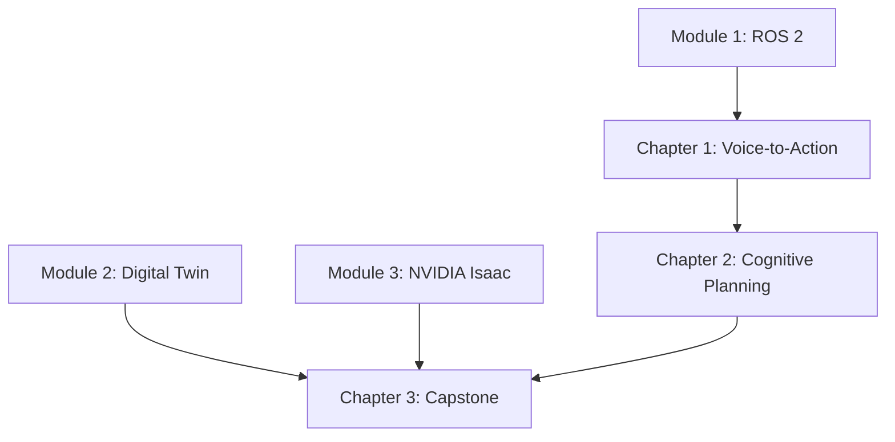

# Tasks: Module 4 – Vision-Language-Action (VLA)

**Input**: Design documents from `/specs/004-vla-module/`
**Prerequisites**: plan.md ✓, spec.md ✓, research.md ✓, content-model.md ✓

**Tests**: Not requested in specification - focusing on documentation tasks.

**Organization**: Tasks are grouped by user story to enable independent implementation and testing of each chapter.

## Format: `[ID] [P?] [Story] Description`

- **[P]**: Can run in parallel (different files, no dependencies)
- **[Story]**: Which user story this task belongs to (US1=Voice-to-Action, US2=Cognitive Planning, US3=Capstone)
- Include exact file paths in descriptions

## Path Conventions

- **Documentation**: `frontend_book/docs/module-4-vla/`
- **Code Examples**: `examples/module-4/chapter-N/`

---

## Phase 1: Setup (Module Structure)

**Purpose**: Create Docusaurus module structure and category configuration

- [ ] T001 Create module directory at frontend_book/docs/module-4-vla/
- [ ] T002 Create _category_.json with module metadata in frontend_book/docs/module-4-vla/
- [ ] T003 [P] Create index.md module overview in frontend_book/docs/module-4-vla/
- [ ] T004 [P] Create examples directory structure at examples/module-4/

---

## Phase 2: Foundational (Example Code Framework)

**Purpose**: Create code example structure that all chapters depend on

**⚠️ CRITICAL**: Chapter content references these examples

- [ ] T005 Create chapter-1 whisper_node directory at examples/module-4/chapter-1/whisper_node/
- [ ] T006 [P] Create chapter-1 audio_capture directory at examples/module-4/chapter-1/audio_capture/
- [ ] T007 [P] Create chapter-1 command_parser directory at examples/module-4/chapter-1/command_parser/
- [ ] T008 [P] Create chapter-2 llm_planner directory at examples/module-4/chapter-2/llm_planner/
- [ ] T009 [P] Create chapter-2 llm_planner/prompts directory at examples/module-4/chapter-2/llm_planner/prompts/
- [ ] T010 [P] Create chapter-2 action_executor directory at examples/module-4/chapter-2/action_executor/
- [ ] T011 [P] Create chapter-3 autonomous_humanoid directory at examples/module-4/chapter-3/autonomous_humanoid/
- [ ] T012 [P] Create chapter-3 autonomous_humanoid/launch directory at examples/module-4/chapter-3/autonomous_humanoid/launch/
- [ ] T013 [P] Create chapter-3 monitoring directory at examples/module-4/chapter-3/monitoring/
- [ ] T014 [P] Create chapter-3 demo_scenarios directory at examples/module-4/chapter-3/demo_scenarios/

**Checkpoint**: Example directory structure ready - chapter implementation can begin

---

## Phase 3: User Story 1 - Voice-to-Action Interface (Priority: P1) 🎯 MVP

**Goal**: Set up voice-controlled interface with Whisper STT and command parsing connected to ROS 2.

**Independent Test**: Speak commands to robot and verify correct ROS 2 topic/action invocations.

**Word Count Target**: 2500-3000 words | **Duration**: 90-120 minutes

### Implementation for User Story 1

- [ ] T015 [US1] Write Introduction to Voice-Controlled Robotics section (300 words) covering voice pipeline architecture in frontend_book/docs/module-4-vla/chapter-1-voice-to-action.md
- [ ] T016 [US1] Write Audio Capture with ROS 2 section (400 words) covering audio_common package, microphone config in frontend_book/docs/module-4-vla/chapter-1-voice-to-action.md
- [ ] T017 [US1] Write Speech-to-Text with OpenAI Whisper section (600 words) covering model sizes, local vs API, ROS 2 node in frontend_book/docs/module-4-vla/chapter-1-voice-to-action.md
- [ ] T018 [US1] Write Command Parsing and Intent Extraction section (500 words) covering rule-based parsing, intent schema, LLM fallback in frontend_book/docs/module-4-vla/chapter-1-voice-to-action.md
- [ ] T019 [US1] Write Mapping Intents to ROS 2 Actions section (400 words) covering command routing, publishers vs action clients in frontend_book/docs/module-4-vla/chapter-1-voice-to-action.md
- [ ] T020 [US1] Write Wake-Word Detection section (300 words) covering Porcupine, OpenWakeWord, VAD in frontend_book/docs/module-4-vla/chapter-1-voice-to-action.md
- [ ] T021 [US1] Write Hands-On Exercise with step-by-step voice control setup in frontend_book/docs/module-4-vla/chapter-1-voice-to-action.md
- [ ] T022 [P] [US1] Create whisper_node.py Whisper ROS 2 transcription node at examples/module-4/chapter-1/whisper_node/whisper_node.py
- [ ] T023 [P] [US1] Create audio_config.yaml audio capture configuration at examples/module-4/chapter-1/audio_capture/audio_config.yaml
- [ ] T024 [P] [US1] Create intent_parser.py rule-based intent extraction at examples/module-4/chapter-1/command_parser/intent_parser.py
- [ ] T025 [P] [US1] Create commands.yaml command vocabulary definition at examples/module-4/chapter-1/command_parser/commands.yaml
- [ ] T026 [P] [US1] Create voice_control.launch.py full voice pipeline launch at examples/module-4/chapter-1/voice_control.launch.py
- [ ] T027 [US1] Add Learning Objectives, Prerequisites, Key Takeaways, and Next Steps sections to chapter-1-voice-to-action.md

**Checkpoint**: Chapter 1 complete - Voice-to-Action documentation fully functional and testable

---

## Phase 4: User Story 2 - Language-Driven Cognitive Planning (Priority: P2)

**Goal**: Implement LLM-based task planning with action sequencing and ROS 2 action execution.

**Independent Test**: Provide task descriptions and verify planner generates valid action sequences.

**Word Count Target**: 2500-3000 words | **Duration**: 90-120 minutes

### Implementation for User Story 2

- [ ] T028 [US2] Write LLMs for Robot Task Planning section (400 words) covering grounding, limitations, ethics in frontend_book/docs/module-4-vla/chapter-2-cognitive-planning.md
- [ ] T029 [US2] Write Robot Capability Registry section (400 words) covering YAML schema, action server mapping in frontend_book/docs/module-4-vla/chapter-2-cognitive-planning.md
- [ ] T030 [US2] Write LLM Integration with ROS 2 section (500 words) covering OpenAI API, prompt engineering, Ollama alternative in frontend_book/docs/module-4-vla/chapter-2-cognitive-planning.md
- [ ] T031 [US2] Write Task Decomposition and Planning section (500 words) covering action sequencing, handling impossible tasks in frontend_book/docs/module-4-vla/chapter-2-cognitive-planning.md
- [ ] T032 [US2] Write Action Execution with Behavior Trees section (500 words) covering BehaviorTree.CPP, action nodes in frontend_book/docs/module-4-vla/chapter-2-cognitive-planning.md
- [ ] T033 [US2] Write Execution Monitoring and Replanning section (400 words) covering failure detection, replanning in frontend_book/docs/module-4-vla/chapter-2-cognitive-planning.md
- [ ] T034 [US2] Write Hands-On Exercise with step-by-step pick-and-place planner in frontend_book/docs/module-4-vla/chapter-2-cognitive-planning.md
- [ ] T035 [P] [US2] Create planner_node.py LLM-based task planner at examples/module-4/chapter-2/llm_planner/planner_node.py
- [ ] T036 [P] [US2] Create capabilities.yaml robot capability definitions at examples/module-4/chapter-2/llm_planner/capabilities.yaml
- [ ] T037 [P] [US2] Create task_planner.txt prompt template at examples/module-4/chapter-2/llm_planner/prompts/task_planner.txt
- [ ] T038 [P] [US2] Create executor_node.py action sequence executor at examples/module-4/chapter-2/action_executor/executor_node.py
- [ ] T039 [P] [US2] Create behavior_tree.xml sample behavior tree at examples/module-4/chapter-2/action_executor/behavior_tree.xml
- [ ] T040 [P] [US2] Create planning.launch.py planning system launch at examples/module-4/chapter-2/planning.launch.py
- [ ] T041 [US2] Add Learning Objectives, Prerequisites, Key Takeaways, and Next Steps sections to chapter-2-cognitive-planning.md

**Checkpoint**: Chapter 2 complete - Cognitive Planning documentation fully functional

---

## Phase 5: User Story 3 - Autonomous Humanoid Capstone (Priority: P3)

**Goal**: Integrate all modules into complete autonomous humanoid system with end-to-end demo.

**Independent Test**: Execute "fetch the water bottle" task with voice control through full pipeline.

**Word Count Target**: 2500-3000 words | **Duration**: 120-150 minutes

### Implementation for User Story 3

- [ ] T042 [US3] Write System Architecture Overview section (400 words) covering full pipeline, module integration in frontend_book/docs/module-4-vla/chapter-3-capstone.md
- [ ] T043 [US3] Write High-Level State Machine section (500 words) covering YASMIN, states, transitions in frontend_book/docs/module-4-vla/chapter-3-capstone.md
- [ ] T044 [US3] Write Integrating Navigation (Nav2) section (400 words) covering goal pose generation, feedback in frontend_book/docs/module-4-vla/chapter-3-capstone.md
- [ ] T045 [US3] Write Integrating Perception (Isaac ROS) section (400 words) covering object detection, scene understanding in frontend_book/docs/module-4-vla/chapter-3-capstone.md
- [ ] T046 [US3] Write Integrating Manipulation (Simulated) section (400 words) covering pick/place, grasp planning in frontend_book/docs/module-4-vla/chapter-3-capstone.md
- [ ] T047 [US3] Write Monitoring Dashboard section (300 words) covering ROS 2 Web Bridge, visualization in frontend_book/docs/module-4-vla/chapter-3-capstone.md
- [ ] T048 [US3] Write Hands-On Exercise with complete fetch-the-object demo in frontend_book/docs/module-4-vla/chapter-3-capstone.md
- [ ] T049 [P] [US3] Create state_machine.py YASMIN state machine at examples/module-4/chapter-3/autonomous_humanoid/state_machine.py
- [ ] T050 [P] [US3] Create humanoid_config.yaml system configuration at examples/module-4/chapter-3/autonomous_humanoid/humanoid_config.yaml
- [ ] T051 [P] [US3] Create full_system.launch.py complete system launch at examples/module-4/chapter-3/autonomous_humanoid/launch/full_system.launch.py
- [ ] T052 [P] [US3] Create dashboard_config.yaml monitoring configuration at examples/module-4/chapter-3/monitoring/dashboard_config.yaml
- [ ] T053 [P] [US3] Create fetch_object.yaml demo scenario definition at examples/module-4/chapter-3/demo_scenarios/fetch_object.yaml
- [ ] T054 [P] [US3] Create navigate_and_report.yaml alternative demo at examples/module-4/chapter-3/demo_scenarios/navigate_and_report.yaml
- [ ] T055 [US3] Add Learning Objectives, Prerequisites, Key Takeaways, and Conclusion sections to chapter-3-capstone.md

**Checkpoint**: Chapter 3 complete - Capstone documentation fully functional

---

## Phase 6: Polish & Cross-Cutting Concerns

**Purpose**: Final validation and cross-chapter consistency

- [ ] T056 [P] Verify all internal links between chapters work correctly
- [ ] T057 [P] Verify all code examples are syntactically correct (Python, YAML, XML)
- [ ] T058 [P] Add admonitions for tips, warnings, and hardware requirements
- [ ] T059 [P] Add platform-specific notes (local Whisper vs API, Ollama vs OpenAI)
- [ ] T060 Verify consistent terminology with OpenAI, ROS 2, and NVIDIA documentation
- [ ] T061 Run Docusaurus build to verify no errors (npm run build)
- [ ] T062 Update module index.md with complete chapter links and overview

---

## Dependencies & Execution Order

### Phase Dependencies

- **Setup (Phase 1)**: No dependencies - can start immediately
- **Foundational (Phase 2)**: Depends on Setup completion - creates example structure
- **User Stories (Phase 3-5)**: All depend on Foundational phase completion
  - User stories can proceed in parallel (if staffed)
  - Or sequentially in priority order (P1 → P2 → P3)
- **Polish (Phase 6)**: Depends on all user stories being complete

### User Story Dependencies

- **User Story 1 (P1)**: Can start after Foundational (Phase 2) - No dependencies on other stories
- **User Story 2 (P2)**: Can start after Foundational (Phase 2) - References Chapter 1 concepts but independently testable
- **User Story 3 (P3)**: Depends on US1 and US2 concepts - integrates all chapters

### Content Dependencies (from spec.md)



### Parallel Opportunities

- All Setup tasks marked [P] can run in parallel
- All Foundational tasks (T005-T014) marked [P] can run in parallel
- Code example tasks within each story (marked [P]) can run in parallel
- Different user stories can be worked on in parallel by different team members
- Polish tasks marked [P] can run in parallel

---

## Parallel Example: User Story 1

```bash
# Launch all code examples for User Story 1 together:
Task: "Create whisper_node.py at examples/module-4/chapter-1/whisper_node/"
Task: "Create audio_config.yaml at examples/module-4/chapter-1/audio_capture/"
Task: "Create intent_parser.py at examples/module-4/chapter-1/command_parser/"
Task: "Create commands.yaml at examples/module-4/chapter-1/command_parser/"
Task: "Create voice_control.launch.py at examples/module-4/chapter-1/"
```

---

## Implementation Strategy

### MVP First (User Story 1 Only)

1. Complete Phase 1: Setup (T001-T004)
2. Complete Phase 2: Foundational (T005-T014)
3. Complete Phase 3: User Story 1 - Voice-to-Action (T015-T027)
4. **STOP and VALIDATE**: Build passes, Chapter 1 readable
5. Deploy/demo if ready

### Incremental Delivery

1. Setup + Foundational → Module structure ready
2. Add Chapter 1 (Voice-to-Action) → Build → **MVP complete!**
3. Add Chapter 2 (Cognitive Planning) → Build → Planning content ready
4. Add Chapter 3 (Capstone) → Build → Full module ready
5. Polish → Final validation → Module 4 complete

### Parallel Team Strategy

With multiple developers:

1. Team completes Setup + Foundational together
2. Once Foundational is done:
   - Developer A: User Story 1 (Voice-to-Action)
   - Developer B: User Story 2 (Cognitive Planning)
   - Developer C: User Story 3 (Capstone)
3. Chapters complete and integrate independently

---

## Task Summary

| Phase | Tasks | Parallel Tasks | Description |
|-------|-------|----------------|-------------|
| Phase 1: Setup | 4 | 2 | Module directory structure |
| Phase 2: Foundational | 10 | 9 | Example code directories |
| Phase 3: US1 Voice-to-Action | 13 | 5 | Chapter 1 content + examples |
| Phase 4: US2 Cognitive Planning | 14 | 6 | Chapter 2 content + examples |
| Phase 5: US3 Capstone | 14 | 6 | Chapter 3 content + examples |
| Phase 6: Polish | 7 | 4 | Validation and consistency |
| **Total** | **62** | **32** | |

---

## Notes

- [P] tasks = different files, no dependencies
- [Story] label maps task to specific user story for traceability
- Each chapter should be independently completable and testable
- Commit after each task or logical group
- Stop at any checkpoint to validate chapter independently
- Word counts and durations from content-model.md
- All code examples must be syntactically correct per FR-020
